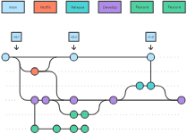

## develop branches

develop branch serves as an integration branch for features. 

## feature branches

pushed to the central repo for backup/collaboration
 
But, instead of branching off of main, feature branches use develop as their parent branch. 
When a feature is complete, it gets merged back into develop.
```bash
$ git checkout develop
$ git checkout -b feature_branch

$ git checkout develop
$ git merge feature_branch
```
## release branches

Once develop has acquired enough features for a release
you fork a release branch off of develop

- no new features added
- only bug fixes and documentation generation
 
Once it's ready to ship, the `release` branch gets merged into `main` and tagged with a version number.

```bash
$ git checkout develop
$ git checkout -b release/0.1.0
$ git checkout main
$ git merge release/0.1.0
```


## Hotfix branches

fork out `main` branch

```bash
$ git checkout main
$ git checkout -b hotfix_branch


$ git checkout main
$ git merge hotfix_branch
$ git checkout develop
$ git merge hotfix_branch
$ git branch -D hotfix_branch
```

## Summary

