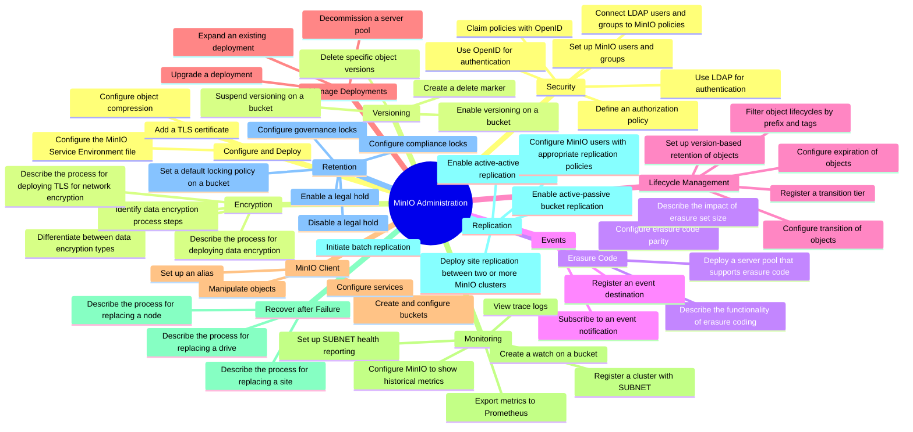

```mermaid
mindmap
  root((MinIO Administration))
    Configure and Deploy
        Configure the MinIO Service Environment file
        Add a TLS certificate
        Configure object compression
    Encryption
        Differentiate between data encryption types
        Describe the process for deploying data encryption
        Identify data encryption process steps
        Describe the process for deploying TLS for network encryption
    Erasure Code
        Describe the functionality of erasure coding
        Deploy a server pool that supports erasure code
        Configure erasure code parity
        Describe the impact of erasure set size
    Events
        Register an event destination
        Subscribe to an event notification
    Lifecycle Management
        Configure expiration of objects
        Register a transition tier
        Configure transition of objects
        Set up version-based retention of objects
        Filter object lifecycles by prefix and tags
    Manage Deployments
        Expand an existing deployment
        Decommission a server pool
        Upgrade a deployment
    MinIO Client
        Set up an alias
        Create and configure buckets
        Manipulate objects
        Configure services

    Monitoring
        Create a watch on a bucket
        Register a cluster with SUBNET
        Set up SUBNET health reporting
        View trace logs
        Export metrics to Prometheus
        Configure MinIO to show historical metrics
    Recover after Failure
        Describe the process for replacing a drive
        Describe the process for replacing a node
        Describe the process for replacing a site
    Replication
        Enable active-passive bucket replication
        Enable active-active bucket replication
        Deploy site replication between two or more MinIO clusters
        Configure MinIO users with appropriate replication policies
        Initiate batch replication
    Retention
        Configure governance locks
        Configure compliance locks
        Set a default locking policy on a bucket
        Enable a legal hold
        Disable a legal hold
    Security
        Define an authorization policy
        Set up MinIO users and groups
        Use LDAP for authentication
        Connect LDAP users and groups to MinIO policies
        Use OpenID for authentication
        Claim policies with OpenID
    Versioning
        Enable versioning on a bucket
        Create a delete marker
        Suspend versioning on a bucket
        Delete specific object versions

```
